# **Type Library** 

 

# **Introduction**
 
Portfolio Project 2 - Code Institute Full Stack Development Diploma
  
Type Library is an interactive front-end site which serves the purpose of helping users improve their typing speed (WPM) and accuracy, using a unique approach to learning.
  
Traditional online typing tests often rely on paragraphs consisting of randomly generated words which do not form sentences or hold any kind of meaning. This approach tests ones typing skills but can be a rather dull exercise for the user and does little to engage their mind with the actual content they are typing. 
  
The 'Type Library' application aims to solve this problem by incorporating excerpts from well-known classic and cult novels, to make type practice more engaging and enriching. 
  
Our approach transforms typing from an often monotonous practice into one that engages users with meaningful and beautifully written text, providing context and narrative that enhances their motivation and enjoyment. This approach not only helps improve typing speed and accuracy but also introduces users to valuable literature, potentially sparking interest in new books and authors. 
  
Typing excerpts from well-crafted prose can aid in developing a deeper understanding of language, rhythm, and structure, making the practice not just a test of skill but an opportunity for literary appreciation and learning. 
  

Deployed website can be be found here: [Type Library](https://k-nadia.github.io/project-2/index.html)
  

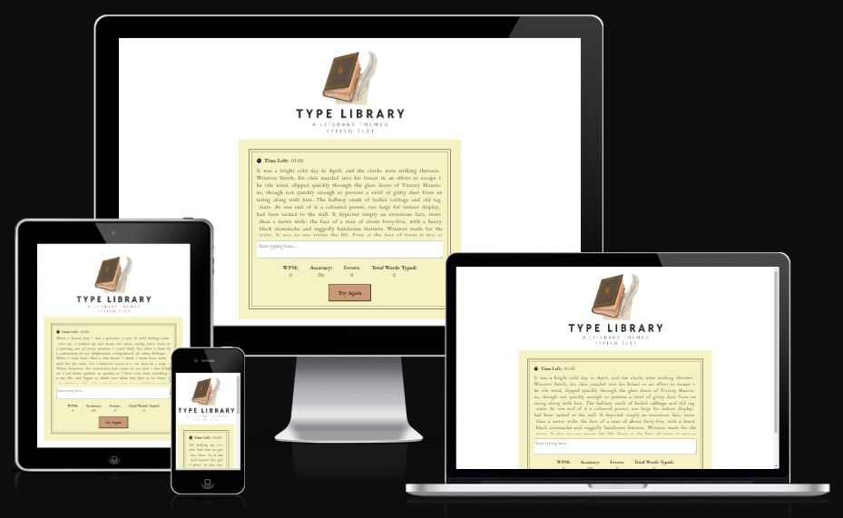

# Table of Contents

- [Design](#design)
	- [Colours](#colours)
    - [Typography](#typography)
- [UX / UI](#UX/UI)
	- [User Stories](#user-stories)
	- [Wireframes](#wireframes)
- [Features](#features)
	- [Navigation](#navigation)
- [Testing](#testing)
    - [Javascript Linter Tool](#javascript-linter-tool)
    - [HTML W3C Validator](#html-w3c-validator)
    - [CSS Jigsaw Validator](#css-jigsaw-validator)
    - [Google Chrome Lighthouse Tool](#google-chrome-lighthouse-tool)
    - [Unfixed Bugs](#unfixed-bugs)
- [Deployment](#deployment)
- [Technologies Used](#technologies-used)
	- [Languages Used](#languages-used)
	- [Frameworks, Libraries & Programs Used ](frameworks-libraries-and-programs-used)
- [Credits](#credits)
	- [Content Sources](#content-sources)
  - [Content Generators](#content-generators)
  - [Image Sources](#images-sources)
  - [Special Thanks](#special-thanks)

    

 

## **DESIGN**

### **Colours**

The chosen colour palette for the Type Library website is a perfect fit for its literary theme, blending classic tones with accessibility considerations to enhance the user experience. The palette consists of six colours:

**#635042:**
 
The rich brown colour evokes the look of aged, leather-bound books, lending a vintage feel that resonates with the literary theme. It is used for the content box border to emphasize the main test area, while maintaining an air of sophistication.

**#CA9A76:**
 
A warm, light brown shade, this colour is reminiscent of old, well-worn paper or wooden bookshelves. It adds a natural tone that makes the site feel inviting, akin to a library or study room. Used within the logo and the reset button background colour.

**#F5F3C4:** 
 
This soft, pale yellow colour was the first colour I selected for the palette due to its similarity to the yellowing pages of an antique book. It creates a warm and gentle background that is easy on the eyes, while also evoking the nostalgic feeling of reading a classic novel. Used for the test area background colour.

**#2B2B2B:**
 
This dark grey was incorporated due to its ability to provide high contrast without the harshness of pure black. It ensures readability while keeping the overall aesthetic softer and more in line with the vintage theme. Used for the logo title heading.

**#000000:** 
 
Pure black was chosen for the highest contrast elements (all of the text within the test area), ensuring maximum legibility and accessibility for all users, including those with visual impairments. 

**#FFFFFF:**
 
The white colour offers simplicity and high contrast, serving as a clean background that allows other colours and text to stand out sharply. It keeps the design modern and uncluttered, balancing the vintage tones with a contemporary feel. White was used as the webpage background colour.

Collectively these colours create an inviting and accessible environment for users to practice their typing but also immerse them in the experience of interacting with classic literary content.

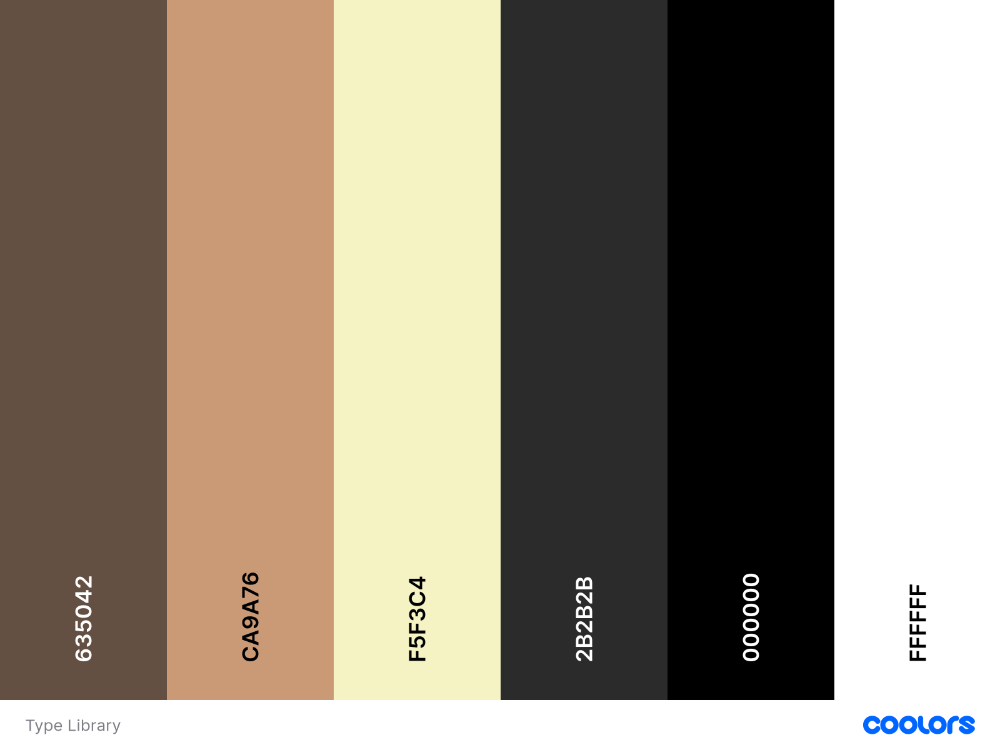

### **Typography**

All fonts used throughout the application were sourced from [Google Fonts](https://fonts.google.com/).
 
- EB Garamond
- Used for: body
- I chose to use this serif font throughout the website because it closely resembles the typefaces commonly used in printed books, evoking a sense of nostalgia and authenticity that aligns perfectly with the literary theme of the platform. By incorporating EB Garamond, users can enjoy an immersive typing experience that mirrors the feel of reading classic literature, helping to create a deeper connection to the text they are typing. Its readability and classic aesthetics not only enhance the visual appeal of the website but also honor the literary tradition, making it a fitting choice for a site dedicated to showcasing the beauty of classic prose.
  
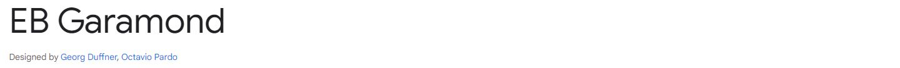
  
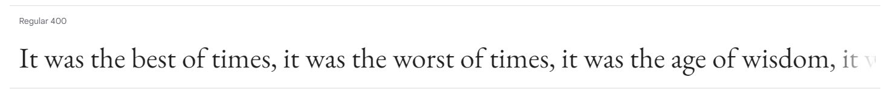

## **UX / UI**

### **User Stories**

As a user:

- I want to choose the duration of the typing test (30 seconds, 1 minute, etc.) so that I can customize my experience based on my available time or focus level.

- I want the game to generate a random excerpt from a literary novel so that I can enjoy engaging content while practicing my typing skills.

- I want to receive my results immediately after completing the typing test to gain instant feedback on my performance and track my progress.

- I want to see my words per minute (WPM) score on the results page so that I can evaluate the speed of my typing.

- I want to see my accuracy percentage on the results page to understand how well I typed the provided excerpt without errors.

- I want to view the total number of words typed so that I can measure my productivity during the test.

- I want to know the total number of errors made so that I can identify areas for improvement in my typing skills.

- I want the ability to retry the test after viewing my results so that I can practice and improve my typing speed and accuracy.

- I want to see the book title and the author of the excerpt I typed so that I can discover new literature and potentially find my next read.

As a developer: 

- I want to access a README file so that I can understand the scope and purpose of the project and locate essential information regarding the website
- I want to access deployment information so I can follow step-by-step instructions on how to deploy the project

### **Wireframes**

 

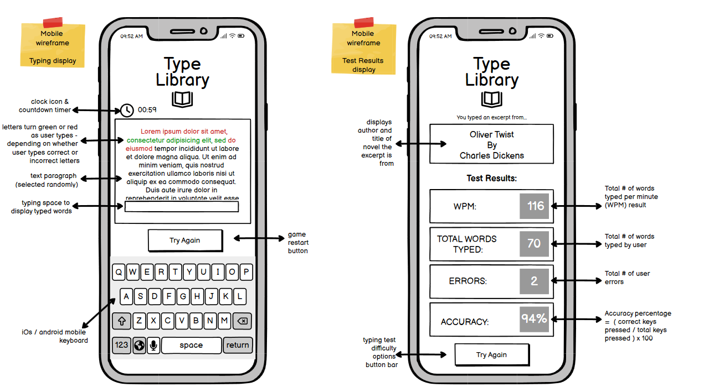
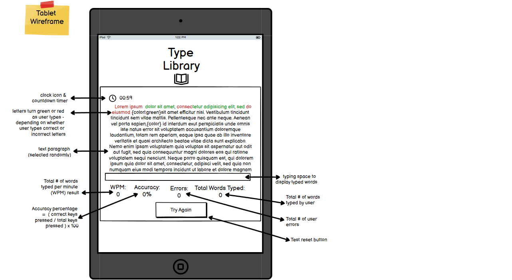
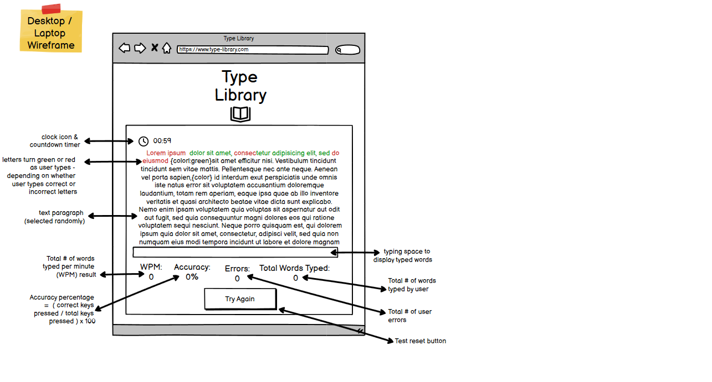

## **FEATURES**

### **Features to Implement in the Future**

Additional features I would like to implement to this project would be:
- Easy/Moderate/Difficult levels of difficulty the user can choose from, with increasingly complex writing styles from which to type.
- 'Dark' mode, where user can change the test display theme to a high-contrast dark mode interface.
- Option to select a specific genre of novel to type i.e. classic literature, sci-fi, dystopian, memoir, romance etc.
- Multiple text size options for users to select, to increase accessibility.
- Addition test duration options (e.g. 30 seconds, 2 minutes etc.) so users can select a duration based on their preference.

## **TESTING**

### **General Site Testing**
| Element                                   | Action (if applicable)                         | Expected Outcome                                   | Result |
|:-----------------------------------------:|:----------------------------------------------:|:--------------------------------------------------:|:------:|
| Content box                               | Load web page                                  | A randomly selected paragraph from the 'excerpts' array is displayed | Pass |
| Content box                               | Scroll mouse while cursor is over the contents box | Text content scrolls to display the complete paragraph | Pass |
| Content box                               | Type letter in input box (that matches excerpt character and position) | Letter turns green (correct) | Pass |
| Content box                               | Type letter in input box (that does not match excerpt character and position) | Letter turns red (incorrect) | Pass |
| Content box                               | Click 'Try Again Button'                       | Excerpt font color returns to original black color | Pass |
| Content box                               | Click 'Try Again Button'                       | The randomly selected paragraph is replaced with a different randomly selected paragraph from the 'excerpts' array | Pass |
| Content scrollbar                         | Scroll up or down                       | Typing text paragraph moves up or down according to scroll direction  | Pass   |
| Content scrollbar                         | Type the last word visible in the typing text paragraph                       | Scroll bar automatically moves the text upwards so the next words to be typed are visible to user | Pass   |
| Countdown timer                           | Load web page                                  | Static timer displays 01:00                                | Pass |
| Typing text cursor                        | Load web page                                  | Blinking cursor is displayed on left hand side of the first character within the typing text paragraph                                | Pass |
| Typing text cursor                        | Type in input box                                  | For each character the user types, the blinking cursor moves right one character to correspond with user's typing position                               | Pass |
| Countdown timer                           | Press any key while cursor is activated within the input box | Timer begins to countdown from 01:00 to 00:00 in one second increments| Pass |
| Countdown timer                           | N/A                                            | Countdown stops once 00:00 is reached              | Pass   |
| Countdown timer                           | Click 'Try Again Button'                       | Countdown resets to 01:00                          | Pass   |
| Text input box                            | Load web page                                  | Placeholder text is displayed within text input box| Pass |
| Text input box                            | Click on input box                             | Placeholder text disappears and blinking cursor appears| Pass |
| Text input box                            | Type in input box                              | All text user types is displayed within text input box| Pass |
| Text input box                            | Press any keys while cursor is activated within the input box  | All typed text appears within the input box   | Pass   |
| Text input box                            | Click 'Try Again Button'                       | All typed text within the input box is cleared and the placeholder text reappears    | Pass   |
| Text input box                            | Input box loses focus (empty)                  | Placeholder text reappears                              | Pass |
| Try Again Button                          | Click 'Try Again Button'                       | Triggers the following actions: load new excerpt paragraph, reset timer to 01:00, clear text input box     | Pass   |
| Results Scores                         | Load web page                      | All results (WPM, accuracy, errors, total words typed) display zero values   | Pass   |
| Results Scores                      | Countdown timer reaches 00:00                       | All results (WPM, accuracy, errors, total words typed) display results scores based on the users typing performance during the past minute   | Pass   |
| Results Scores (WPM)                        | Countdown timer reaches 00:00                       | Displays the user's word per minute typing speed (based on correctly typed words only)   | Pass   |
| Results Scores (Accuracy)                     | Countdown timer reaches 00:00                       | Displays the user's typing accuracy % | Pass   |
| Results Scores (Errors)                        | Countdown timer reaches 00:00                       | Displays the user's total amount of typing errors  | Pass   |
| Results Scores (Total Words Typed)                        | Countdown timer reaches 00:00                       | Displays the user's total amount of words typed within time limit | Pass   |
| Results                         | Click 'Try Again Button'                       | All results (WPM, accuracy, errors, total words typed) reset to zero values   | Pass   |

 
The site was checked and is working seamlessly and without errors or problems in multiple browsers: Chrome, Firefox, Microsoft Edge IE and Safari.
  
Extensive testing was conducted using Google Chrome Developer Tools, within the Google Chrome browser.
  

The following simulated mobile devices were tested using the Chrome Developer Tools device mode to emulate user experience on a wide range of devices:
- Galaxy Note II/III/S5 (360px x 640px)
- Galaxy S5 (360 x 640px)
- Galaxy S8 (360px x 740px)
- Galaxy 9+ (320px x 658px)
- Galaxy Tab S4 (712px x 1138px)
- Galazy Z Fold 5 (344px x 882px)
- Samsung Galaxy S8+ (360px 740px)
- Samsung Galaxy S20 Ultra (412px x 915px)
- Samsung Galaxy A51/71 (412px x 914px)
- Nokia N9 (480px x 854px)
- Pixel 3 (393px x 786px)
- Pixel 4 (353px x 745px)
- Pixel 7 (412px x 915px)
- iPhone SE (375px x 667px)
- iPhone XR (414px x 896px)
- iPhone 12 Pro (390px x 844px)
- iPhone 14 Pro Max (430px x 932px)
- iPhone 5/SE (320px x 578px)
- iPhone 6/7/8 (375px x 667px)
- iPhone 6/7/8 Plus (414px x 736px)
- iPhone X (375px x 812px)
- iPad (768px x 1024px)
- iPad Pro (1024px x 1366px)
- iPad Mini (768px x 1024px)
- iPad Air (820px x 1180px)
- Asus Zenbook Fold (853px x 1280px)

### **Troubleshooting**

### **Issue 1**

When developing the loadRandomExcerpt function, I noticed that upon running the function the console did not randomly select and log one of the text paragraphs within 'const = excerpt', which would be the anticipated result. The 'excerpt' variable was contained within a separate js file called excerpts.js.

I realised that the error was likely caused because I was previewing the site on a temporary host rather than the fully deployed site and that this may cause the preview difficulty because the code was located in a separate file. In order to rectify this, I temporarily moved the 'excerpt' variable code inside of the script.js file. This fixed the issue and the console logged the correct content - a random text parapgrah selected from the excerpts variable.

Below - console error message.

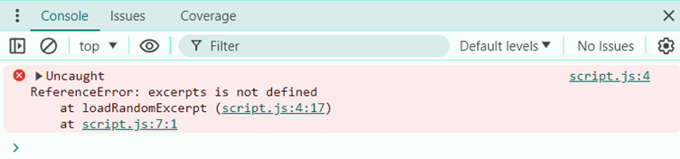
 

Below - excerpts variable code, moved temporarily into script.js file.

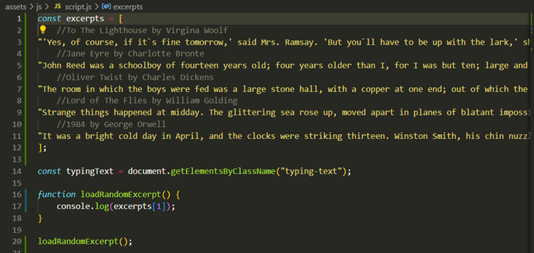
 

Below - console running correctly with expected outcome, once issue was resolved.

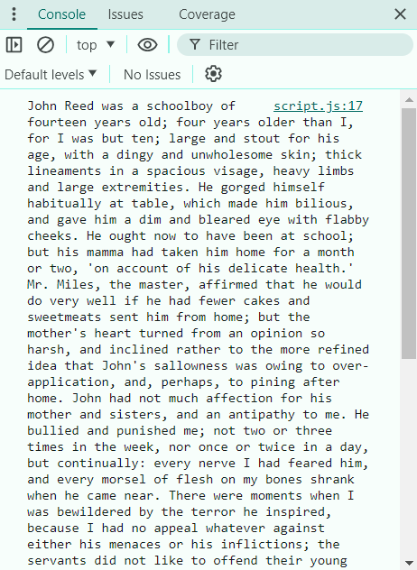

### **Issue 2**

After amending the loadRandomExcerpt code to trigger a paragraph from the excerpts variable to be displayed on the site (rather than just the console.log) the expected result was not produced and the excerpt text failed to appear on the browser. I determined error must likely be caused by an issue with retrieving elements from the "typing-text" class, because I had used document.getElementsByClass("typing-text") to fetch the correct elements from the DOM. Upon further Googling and investigation, I found a query on Stack Overflow which related to a user having similar problems when using '.getElementByClassName()'. Answers to the query suggested .getElementsByClassName() method returns a live HTML collection of elements, whereas .querySelector() returns a single static NodeList object. As my aim was to retrieve a single element from an array (instead of a collection) of elements, it made sense that the .getElementsByClassName() would not be producing the desired result. Upon replacing .getElementsByClassName() with .querySelector(), the code worked correctly without issue.

Below - original code that was not functioning correctly.

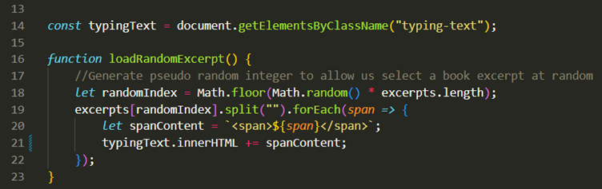

### **Issue 3**

Once I tested my countdown timer I found that the timer countdown was resetting every time a key was pressed on the keyboard, causing the typing text timer countdown to continuously reset itself as the user typed. I fixed this by adding the 'once' option to the code and setting it to 'true'. This ensured that the event listener would only be triggered by the first key stroke from the user and not by subsequent key strokes.

Below - browser screenshot taken when errors occurred.

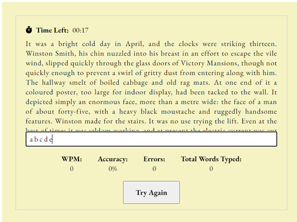

Below - code not functioning correctly.

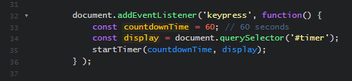

Below - amended code which produced correct output.

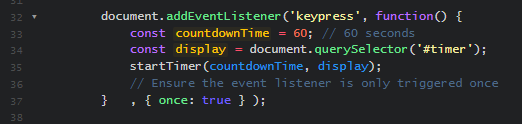

### **Issue 4**

During the site development I can across a bug which was causing the input form to fail to display across the whole width of the content box, as was the expected outcome. I determined that this was being caused by a mismatched element type across html, css and javascript. The "typing-input" element was declared as a class in HTML and CSS, however in Javascript it was an id. Once I amended the html and css code to match the id type of "typing-input", the issue was resolved.

Below - incorrect display which alerted me to locate and fix the bug.

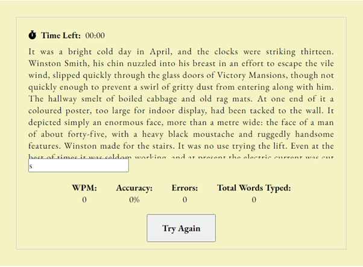

Below - display after bug had been fixed.

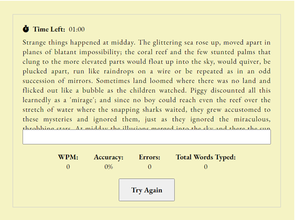

### **Issue 5**

While testing my site, I discovered that once the user completed the typing text, pressed the 'Try Again' button and proceeded to start typing again, the timer failed to start the countdown. After lots of investigating I found that I had to remove and then subsequently add the 'keydown' event listener which triggers startKeyDown function. After this functionality was added, it caused the startKeyDown function to fully reset properly and return to its original function state which in turn caused the timer problem to disappear.

Below - startOnKeyDown function code.

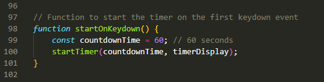

Below - event listener actions added to fix the bug.

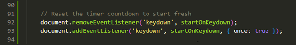

### **Javascript Linter Tool**

No errors found within script.js file when passed through ESLint Javascript Linter.

### **HTML W3C Validator**

No errors found within index.html file when passed through W3C Markup Validator.

### **CSS Jigsaw Validator**

No errors found within style.css file when passed through W3C CSS Jigsaw Validator.

### **Google Chrome Lighthouse Tool**

Google Chrome Dev Tools Lighthouse Testing Results:

<b>Mobile Site</b>
  
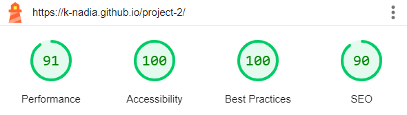

<b>Desktop Site</b>
  
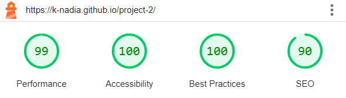

### **Unfixed Bugs**

To my knowledge there are no unfixed bugs.

## **DEPLOYMENT**

This website was deployed to GitHub Pages.

### **Deployment Steps**

Deploy this project using the following steps:
1. Open the respository at [PP2 Github](https://github.com/k-nadia/project-2).
2. Navigate to the 'Settings' tab.
3. Within the 'Code & Automation' section, select 'Pages'
4. Under the 'Branch' section, select 'main' from the drop-down menu.
5. Click on 'save'.
6. Reload the page after a few minutes and the live deployment link will be displayed at the top of the page.

### **Forking Steps**

Fork this project using the following steps:
1. Open the respository at [PP2 Github](https://github.com/k-nadia/project-2).
2. Select the 'Fork' button near the top of the page.
3. After a few minutes the newly forked repository will be created under your GitHub account.

### **Cloning Steps**

Clone this project using the following steps:
1. Open the respository at [PP2 Github](https://github.com/k-nadia/project-2).
2. Select the green 'Code' button near the top of the page.
3. Choose from one of the 3 cloning options: HTTPS, SSH, GitHub CLI.
4. Click on the clipboard icon to copy the URL.
5. Open a new GitPod terminal.
6. Type 'git clone' and paste in the URL copied earlier.
7. Press enter to complete the cloning process. 

## **TECHNOLOGIES USED**

### **Languages Used**
- 
-	
- 

 ## **Frameworks, Libraries & Programs Used**

- - GitHub is a web-based platform for version control using Git, enabling collaborative software development and hosting of code repositories. GitHub connects to GitPod and Heroku. 

-  – Connected to GitHub, GitPod hosted the coding space, allowing the project to be built and then committed to the GitHub repository. Used for version control. 

-  - Diffchecker is a text comparison tool used to highlight the differences between two blocks of text, facilitating comparison and analysis. Update my code against old code for validation.

-  - The W3C CSS Validator is a tool used to check the validity and syntax of CSS code, ensuring compliance with web standards set by the World Wide Web Consortium (W3C). Import my CSS for validation.

-  - The W3C Markup Validator is a tool used to check the validity and syntax of HTML code, ensuring compliance with web standards set by the World Wide Web Consortium (W3C). Import my html for validation.

-  - An open-source tool used for auditing web page quality, including performance, accessibility, SEO, and cross-browser testing. Check for validation.

-  - Optimole is an online image optimizer tool which reduces file size without losing image quality. This tool was used to optimize all images within the project for web.

-  - A graphic design platform that provides online design and visual communication tools.

## **CREDITS**

### **Content Sources**
Excerpts from the following novels were used for the typing text:
- To The Lighthouse by Virgina Woolf
- Jane Eyre by Charlotte Bronte
- Oliver Twist by Charles Dickens
- Lord of The Flies by William Golding
- 1984 by George Orwell
- The Great Gatsby by F. Scott Fitzgerald
- To Kill A Mockingbird by Harper Lee
- Frankenstein by Mary Shelley
- Alice's Adventures in Wonderland By Lewis Caroll
- The Picture of Dorian Grey By Oscar Wilde
- Les Miserables by Victor Hugo
- Moby Dick by Herman 
- Dracula by Bram Stoker
- Great Expectations by Charles Dickens
- Little Women by Louisa May Alcott

All other text content was written by myself.

### **Content Generators**
-   - A favicon.ico icon tool used to generate or download favicon icons in all required sizes. Favicon.io was used to generate favicon.ico file from the Kennet logo JPEG image.

-  - Coolors.co is a online colour palette generator used to visualise and create colour schemes. In this project Coolors was used to pick colours from the Kennet logo and site photo and create a colour palette that reflected the Kennet Shopping ethos and target audience.

-  - Google Fonts is a library of free, open-source fonts available to enhance web design. Google Fonts was used to import all fonts used in the project.

-  - Font Awesome is an icon library and toolkit. Font Awesome was used to source all icons used in this project.

### **Image Credits**
*Image Usage - Site Logo*
 
*Logo created using Canva tools*
 
*Graphic source - Canva*
 
*Canva website link - [Click Here](https://www.canva.com/)*
 

 

### **Special Thanks**
Special thanks to my mentor Diego Pupato for your guidance and support throughout this project.